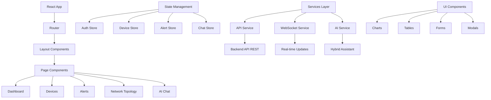
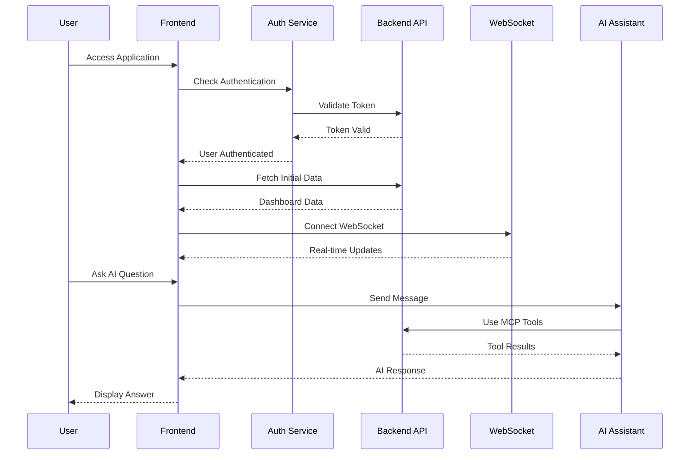

# Design Document: Frontend MikroTik Controller

## Overview

Este documento describe el diseño completo del frontend web para el Controlador MikroTik, una aplicación de gestión centralizada que proporciona una interfaz moderna y profesional para la administración de dispositivos MikroTik. La aplicación incluye un dashboard principal con métricas en tiempo real, sistema de alertas, gestión completa de dispositivos, visualización de topología de red y un chat inteligente integrado con el asistente IA del sistema híbrido backend.

El frontend se conecta al sistema híbrido backend existente que combina API REST + MCP Server + LLM Local, proporcionando tanto funcionalidades tradicionales de gestión como capacidades de inteligencia artificial para consultas en lenguaje natural.

## Architecture

La aplicación sigue una arquitectura moderna de React con separación clara de responsabilidades, gestión de estado centralizada y comunicación eficiente con el backend híbrido.



## Main Algorithm/Workflow



## Core Interfaces/Types

### Authentication Types

```typescript
interface User {
  id: string
  email: string
  tenant_id: string
  role_id: string
  is_active: boolean
  role: {
    id: string
    name: string
    description: string
  }
}

interface AuthState {
  user: User | null
  token: string | null
  refreshToken: string | null
  isAuthenticated: boolean
  isLoading: boolean
}

interface LoginCredentials {
  email: string
  password: string
}
```

### Device Management Types

```typescript
interface Device {
  id: string
  hostname: string
  ip_address: string
  tenant_id: string
  site_id?: string
  ros_version?: string
  ros_major?: number
  architecture?: string
  model?: string
  serial_number?: string
  status: DeviceStatus
  last_seen?: string
  created_at: string
  updated_at: string
}

enum DeviceStatus {
  ONLINE = 'online',
  OFFLINE = 'offline',
  PENDING = 'pending',
  ERROR = 'error'
}

interface DeviceStats {
  total_devices: number
  by_status: Record<string, number>
  by_model: Record<string, number>
  online_devices: number
  offline_devices: number
}
```

### AI Chat Types

```typescript
interface ChatMessage {
  id: string
  message: string
  response?: string
  timestamp: string
  isLoading?: boolean
  error?: string
}

interface ChatState {
  messages: ChatMessage[]
  isConnected: boolean
  isTyping: boolean
}

interface AICapabilities {
  rest_api: {
    available: boolean
    endpoints: string[]
  }
  mcp_server: {
    available: boolean
    tools: string[]
  }
  llm_local: {
    available: boolean
    model: string
    capabilities: string[]
  }
  hybrid_features: {
    intelligent_assistant: boolean
    tool_integration: boolean
    streaming_chat: boolean
    natural_language_queries: boolean
  }
}
```

## Key Functions with Formal Specifications

### Authentication Service

```typescript
class AuthService {
  async login(credentials: LoginCredentials): Promise<LoginResponse>
  async logout(): Promise<void>
  async refreshToken(): Promise<string>
  async getCurrentUser(): Promise<User>
}
```

**Preconditions:**
- `credentials.email` is a valid email format
- `credentials.password` is non-empty string
- Network connection is available

**Postconditions:**
- If successful: Returns valid JWT tokens and user data
- If failed: Throws AuthenticationError with descriptive message
- Authentication state is updated in store
- Tokens are securely stored

**Loop Invariants:** N/A

### Device Management Service

```typescript
class DeviceService {
  async getDevices(filters?: DeviceFilters): Promise<PaginatedResponse<Device>>
  async getDevice(id: string): Promise<Device>
  async createDevice(data: DeviceCreateData): Promise<Device>
  async updateDevice(id: string, data: DeviceUpdateData): Promise<Device>
  async deleteDevice(id: string): Promise<void>
  async getDeviceStats(): Promise<DeviceStats>
}
```

**Preconditions:**
- User is authenticated with valid JWT token
- User has appropriate permissions for device operations
- Device data meets validation requirements

**Postconditions:**
- Returns valid device data conforming to Device interface
- Database operations are atomic and consistent
- Audit logs are created for all operations
- Real-time updates are broadcast to connected clients

**Loop Invariants:**
- For pagination: All returned devices belong to current tenant
- For filtering: All results match specified filter criteria

### AI Assistant Service

```typescript
class AIService {
  async sendMessage(message: string): Promise<string>
  async sendMessageStream(message: string): AsyncGenerator<string>
  async getCapabilities(): Promise<AICapabilities>
  async getStatus(): Promise<AIStatus>
}
```

**Preconditions:**
- User is authenticated with valid session
- AI service is available and connected
- Message is non-empty string

**Postconditions:**
- Returns AI response in natural language
- If tools are used, operations are executed with user permissions
- Chat history is maintained in session
- Streaming responses are properly formatted

**Loop Invariants:**
- For streaming: Each chunk is valid JSON or text
- For tool usage: All operations respect tenant isolation

## Algorithmic Pseudocode

### Main Application Initialization

```typescript
ALGORITHM initializeApplication()
INPUT: none
OUTPUT: initialized application state

BEGIN
  // Step 1: Initialize stores and services
  authStore ← createAuthStore()
  deviceStore ← createDeviceStore()
  alertStore ← createAlertStore()
  chatStore ← createChatStore()
  
  // Step 2: Check existing authentication
  IF hasStoredToken() THEN
    token ← getStoredToken()
    
    TRY
      user ← validateToken(token)
      authStore.setAuthenticated(user, token)
    CATCH TokenExpiredError
      refreshToken ← getStoredRefreshToken()
      IF refreshToken THEN
        newToken ← refreshAuthToken(refreshToken)
        authStore.setAuthenticated(user, newToken)
      ELSE
        redirectToLogin()
      END IF
    END TRY
  ELSE
    redirectToLogin()
  END IF
  
  // Step 3: Initialize real-time connections
  IF authStore.isAuthenticated THEN
    websocketService.connect(authStore.token)
    setupRealTimeSubscriptions()
  END IF
  
  // Step 4: Load initial data
  loadDashboardData()
END
```

### Real-time Data Synchronization

```typescript
ALGORITHM setupRealTimeSubscriptions()
INPUT: authenticated user context
OUTPUT: active real-time subscriptions

BEGIN
  // Device status updates
  websocket.subscribe("device_status", (data) => {
    deviceStore.updateDeviceStatus(data.device_id, data.status)
    IF data.status === "offline" THEN
      alertStore.addAlert({
        type: "device_offline",
        device_id: data.device_id,
        message: `Device ${data.hostname} went offline`
      })
    END IF
  })
  
  // New alerts
  websocket.subscribe("new_alert", (alert) => {
    alertStore.addAlert(alert)
    showNotification(alert)
  })
  
  // Device metrics updates
  websocket.subscribe("device_metrics", (metrics) => {
    deviceStore.updateMetrics(metrics.device_id, metrics.data)
  })
  
  // Connection health monitoring
  websocket.onDisconnect(() => {
    showConnectionError()
    attemptReconnection()
  })
END
```

### AI Chat Processing

```typescript
ALGORITHM processAIChat(message: string)
INPUT: user message string
OUTPUT: AI response with tool integration

BEGIN
  ASSERT message.length > 0
  
  // Step 1: Add user message to chat
  chatId ← generateUUID()
  chatStore.addMessage({
    id: chatId,
    message: message,
    timestamp: now(),
    isLoading: true
  })
  
  // Step 2: Send to AI service
  TRY
    IF streamingEnabled THEN
      response ← ""
      FOR EACH chunk IN aiService.sendMessageStream(message) DO
        response ← response + chunk
        chatStore.updateMessage(chatId, { response: response })
      END FOR
    ELSE
      response ← aiService.sendMessage(message)
      chatStore.updateMessage(chatId, { response: response })
    END IF
    
    chatStore.updateMessage(chatId, { isLoading: false })
    
  CATCH AIServiceError AS error
    chatStore.updateMessage(chatId, {
      isLoading: false,
      error: error.message
    })
  END TRY
END
```

### Device Management Workflow

```typescript
ALGORITHM manageDeviceLifecycle(action: string, deviceData: any)
INPUT: action type and device data
OUTPUT: updated device state

BEGIN
  ASSERT action IN ["create", "update", "delete"]
  ASSERT deviceData IS valid
  
  // Step 1: Validate permissions
  IF NOT hasPermission(action, "device") THEN
    THROW PermissionError("Insufficient permissions")
  END IF
  
  // Step 2: Execute action with optimistic updates
  IF action = "create" THEN
    tempId ← generateTempId()
    deviceStore.addDevice({ ...deviceData, id: tempId, status: "pending" })
    
    TRY
      newDevice ← deviceService.createDevice(deviceData)
      deviceStore.replaceDevice(tempId, newDevice)
      showSuccessNotification("Device added successfully")
    CATCH DeviceError AS error
      deviceStore.removeDevice(tempId)
      showErrorNotification(error.message)
    END TRY
    
  ELSE IF action = "update" THEN
    originalDevice ← deviceStore.getDevice(deviceData.id)
    deviceStore.updateDevice(deviceData.id, deviceData)
    
    TRY
      updatedDevice ← deviceService.updateDevice(deviceData.id, deviceData)
      deviceStore.replaceDevice(deviceData.id, updatedDevice)
    CATCH DeviceError AS error
      deviceStore.replaceDevice(deviceData.id, originalDevice)
      showErrorNotification(error.message)
    END TRY
    
  ELSE IF action = "delete" THEN
    deviceStore.markDeviceDeleting(deviceData.id)
    
    TRY
      deviceService.deleteDevice(deviceData.id)
      deviceStore.removeDevice(deviceData.id)
      showSuccessNotification("Device deleted successfully")
    CATCH DeviceError AS error
      deviceStore.unmarkDeviceDeleting(deviceData.id)
      showErrorNotification(error.message)
    END TRY
  END IF
END
```

## Components and Interfaces

### Layout Components

#### AppLayout

**Purpose**: Proporciona la estructura principal de la aplicación con navegación, header y área de contenido.

**Interface**:
```typescript
interface AppLayoutProps {
  children: React.ReactNode
}

interface AppLayoutState {
  sidebarCollapsed: boolean
  theme: 'light' | 'dark'
  notifications: Notification[]
}
```

**Responsibilities**:
- Gestión del layout responsive
- Control del sidebar y navegación
- Manejo del tema claro/oscuro
- Mostrar notificaciones globales

#### Sidebar

**Purpose**: Navegación principal de la aplicación con menús contextuales.

**Interface**:
```typescript
interface SidebarProps {
  collapsed: boolean
  onToggle: () => void
  currentPath: string
}

interface MenuItem {
  id: string
  label: string
  icon: React.ComponentType
  path: string
  badge?: number
  children?: MenuItem[]
}
```

**Responsibilities**:
- Renderizar menú de navegación
- Indicar página activa
- Mostrar badges de notificaciones
- Soporte para submenús

### Dashboard Components

#### DashboardOverview

**Purpose**: Vista principal del dashboard con métricas clave y resumen del sistema.

**Interface**:
```typescript
interface DashboardOverviewProps {
  refreshInterval?: number
}

interface DashboardData {
  deviceStats: DeviceStats
  alertSummary: AlertSummary
  networkHealth: NetworkHealth
  recentActivity: Activity[]
}
```

**Responsibilities**:
- Mostrar métricas principales en tiempo real
- Gráficos de estado de dispositivos
- Resumen de alertas críticas
- Actividad reciente del sistema

#### MetricsCard

**Purpose**: Componente reutilizable para mostrar métricas individuales.

**Interface**:
```typescript
interface MetricsCardProps {
  title: string
  value: number | string
  trend?: 'up' | 'down' | 'stable'
  trendValue?: number
  icon?: React.ComponentType
  color?: 'primary' | 'success' | 'warning' | 'error'
  loading?: boolean
}
```

**Responsibilities**:
- Visualización de métricas con tendencias
- Indicadores visuales de estado
- Soporte para loading states
- Animaciones de transición

### Device Management Components

#### DeviceList

**Purpose**: Lista paginada de dispositivos con filtros y acciones.

**Interface**:
```typescript
interface DeviceListProps {
  filters?: DeviceFilters
  onDeviceSelect?: (device: Device) => void
  selectionMode?: 'single' | 'multiple' | 'none'
}

interface DeviceListState {
  devices: Device[]
  loading: boolean
  selectedDevices: string[]
  pagination: PaginationState
}
```

**Responsibilities**:
- Renderizar tabla de dispositivos
- Filtrado y búsqueda
- Selección múltiple
- Acciones en lote

#### DeviceCard

**Purpose**: Vista de tarjeta individual para dispositivos.

**Interface**:
```typescript
interface DeviceCardProps {
  device: Device
  onEdit?: (device: Device) => void
  onDelete?: (device: Device) => void
  onCommand?: (device: Device) => void
  compact?: boolean
}
```

**Responsibilities**:
- Mostrar información del dispositivo
- Indicadores de estado visual
- Acciones rápidas
- Vista compacta para listas

#### DeviceForm

**Purpose**: Formulario para crear y editar dispositivos.

**Interface**:
```typescript
interface DeviceFormProps {
  device?: Device
  onSubmit: (data: DeviceFormData) => void
  onCancel: () => void
  loading?: boolean
}

interface DeviceFormData {
  hostname: string
  ip_address: string
  username: string
  password: string
  site_id?: string
}
```

**Responsibilities**:
- Validación de formularios
- Manejo de credenciales seguras
- Modo creación y edición
- Feedback visual de errores

### AI Chat Components

#### ChatInterface

**Purpose**: Interfaz principal del chat con el asistente IA.

**Interface**:
```typescript
interface ChatInterfaceProps {
  embedded?: boolean
  height?: string
  onClose?: () => void
}

interface ChatInterfaceState {
  messages: ChatMessage[]
  inputValue: string
  isTyping: boolean
  isConnected: boolean
}
```

**Responsibilities**:
- Renderizar conversación
- Input de mensajes con autocompletado
- Indicadores de estado de conexión
- Soporte para streaming de respuestas

#### MessageBubble

**Purpose**: Componente individual para mensajes del chat.

**Interface**:
```typescript
interface MessageBubbleProps {
  message: ChatMessage
  isUser: boolean
  isStreaming?: boolean
}
```

**Responsibilities**:
- Renderizar mensaje con formato
- Soporte para markdown
- Animaciones de typing
- Timestamps y estados

### Network Topology Components

#### TopologyViewer

**Purpose**: Visualización interactiva de la topología de red.

**Interface**:
```typescript
interface TopologyViewerProps {
  devices: Device[]
  connections: NetworkConnection[]
  onDeviceClick?: (device: Device) => void
  layout?: 'force' | 'hierarchical' | 'circular'
}

interface NetworkConnection {
  source: string
  target: string
  type: 'ethernet' | 'wireless' | 'vpn'
  status: 'active' | 'inactive'
}
```

**Responsibilities**:
- Renderizar grafo de red interactivo
- Diferentes layouts de visualización
- Zoom y pan
- Información contextual en hover

## Data Models

### Authentication Models

```typescript
interface AuthStore {
  user: User | null
  token: string | null
  refreshToken: string | null
  isAuthenticated: boolean
  isLoading: boolean
  
  // Actions
  login: (credentials: LoginCredentials) => Promise<void>
  logout: () => Promise<void>
  refreshToken: () => Promise<void>
  setUser: (user: User) => void
}
```

**Validation Rules**:
- Email must be valid format
- Token must be valid JWT
- User must have active status

### Device Models

```typescript
interface DeviceStore {
  devices: Map<string, Device>
  stats: DeviceStats | null
  filters: DeviceFilters
  pagination: PaginationState
  loading: boolean
  
  // Actions
  fetchDevices: (filters?: DeviceFilters) => Promise<void>
  createDevice: (data: DeviceCreateData) => Promise<Device>
  updateDevice: (id: string, data: DeviceUpdateData) => Promise<Device>
  deleteDevice: (id: string) => Promise<void>
  updateDeviceStatus: (id: string, status: DeviceStatus) => void
}
```

**Validation Rules**:
- Hostname must be unique within tenant
- IP address must be valid IPv4/IPv6
- Credentials must be encrypted before storage

### Chat Models

```typescript
interface ChatStore {
  messages: ChatMessage[]
  isConnected: boolean
  isTyping: boolean
  capabilities: AICapabilities | null
  
  // Actions
  sendMessage: (message: string) => Promise<void>
  sendMessageStream: (message: string) => AsyncGenerator<string>
  clearHistory: () => void
  connect: () => void
  disconnect: () => void
}
```

**Validation Rules**:
- Messages must be non-empty
- Connection must be authenticated
- History must be limited to prevent memory issues

## Error Handling

### Network Error Scenarios

**Condition**: API request fails due to network issues
**Response**: Show retry mechanism with exponential backoff
**Recovery**: Cache last known state, allow offline browsing

### Authentication Error Scenarios

**Condition**: JWT token expires during session
**Response**: Attempt automatic refresh using refresh token
**Recovery**: If refresh fails, redirect to login with return URL

### Real-time Connection Errors

**Condition**: WebSocket connection drops
**Response**: Show connection status indicator, attempt reconnection
**Recovery**: Implement exponential backoff, fallback to polling

### AI Service Errors

**Condition**: AI assistant is unavailable or times out
**Response**: Show error message in chat, suggest alternative actions
**Recovery**: Allow retry, provide fallback to manual device management

## Testing Strategy

### Unit Testing Approach

Utilizar Jest y React Testing Library para pruebas unitarias de componentes y hooks. Enfoque en:

- Renderizado correcto de componentes
- Manejo de props y estado
- Interacciones de usuario
- Hooks personalizados
- Servicios y utilidades

**Cobertura objetivo**: 90% para componentes críticos, 80% general

### Property-Based Testing Approach

**Property Test Library**: fast-check para JavaScript/TypeScript

Propiedades a probar:
- Validación de formularios con datos aleatorios
- Serialización/deserialización de estado
- Filtros de dispositivos con diferentes combinaciones
- Paginación con diferentes tamaños de página

### Integration Testing Approach

Usar Cypress para pruebas end-to-end:

- Flujos completos de autenticación
- Gestión de dispositivos CRUD
- Chat con IA (con mocks)
- Navegación entre páginas
- Responsive design

### Component Testing

Usar Storybook para desarrollo y testing de componentes:

- Casos de uso de componentes aislados
- Estados de loading y error
- Diferentes variantes de props
- Accesibilidad y temas

## Performance Considerations

### Code Splitting y Lazy Loading

- Dividir rutas principales en chunks separados
- Lazy loading de componentes pesados (gráficos, topología)
- Preload de rutas críticas

### State Management Optimization

- Normalización de datos en stores
- Memoización de selectores computados
- Debounce en filtros y búsquedas
- Paginación virtual para listas grandes

### Real-time Updates Optimization

- Throttling de actualizaciones de métricas
- Batching de updates de estado
- Selective re-rendering con React.memo
- WebSocket message queuing

### Bundle Size Optimization

- Tree shaking de librerías no utilizadas
- Análisis de bundle con webpack-bundle-analyzer
- Optimización de imágenes y assets
- CDN para librerías comunes

## Security Considerations

### Authentication Security

- Secure storage de tokens (httpOnly cookies vs localStorage)
- Automatic token refresh con rotation
- CSRF protection para requests críticos
- Session timeout con warning

### Data Protection

- Sanitización de inputs de usuario
- Validación client-side y server-side
- Encriptación de datos sensibles en tránsito
- No exposición de credenciales en logs

### AI Chat Security

- Sanitización de mensajes de chat
- Rate limiting de requests al AI
- Validación de respuestas del AI
- Audit logging de interacciones

### Network Security

- HTTPS obligatorio en producción
- Content Security Policy (CSP)
- Validación de certificados WebSocket
- Protection contra XSS y injection attacks

## Dependencies

### Core Dependencies

```json
{
  "react": "^18.2.0",
  "react-dom": "^18.2.0",
  "typescript": "^5.0.0",
  "vite": "^4.4.0"
}
```

### State Management

```json
{
  "zustand": "^4.4.0",
  "@tanstack/react-query": "^4.32.0"
}
```

### UI and Styling

```json
{
  "tailwindcss": "^3.3.0",
  "@headlessui/react": "^1.7.0",
  "@heroicons/react": "^2.0.0",
  "framer-motion": "^10.16.0"
}
```

### Charts and Visualization

```json
{
  "recharts": "^2.8.0",
  "d3": "^7.8.0",
  "@visx/visx": "^3.3.0"
}
```

### Networking and Real-time

```json
{
  "axios": "^1.5.0",
  "socket.io-client": "^4.7.0"
}
```

### Routing and Navigation

```json
{
  "react-router-dom": "^6.15.0"
}
```

### Forms and Validation

```json
{
  "react-hook-form": "^7.45.0",
  "zod": "^3.22.0",
  "@hookform/resolvers": "^3.3.0"
}
```

### Development and Testing

```json
{
  "@testing-library/react": "^13.4.0",
  "@testing-library/jest-dom": "^6.1.0",
  "cypress": "^13.2.0",
  "@storybook/react": "^7.4.0",
  "fast-check": "^3.13.0"
}
```

### Utilities

```json
{
  "date-fns": "^2.30.0",
  "lodash-es": "^4.17.0",
  "uuid": "^9.0.0",
  "clsx": "^2.0.0"
}
```

## Correctness Properties

*A property is a characteristic or behavior that should hold true across all valid executions of a system—essentially, a formal statement about what the system should do. Properties serve as the bridge between human-readable specifications and machine-verifiable correctness guarantees.*

### Property 1: Authentication Token Security

*For any* valid user credentials, successful authentication should result in secure token storage using httpOnly cookies and proper session establishment.

**Validates: Requirements 1.1, 1.6**

### Property 2: Authentication Error Handling

*For any* invalid credentials, authentication attempts should fail with descriptive error messages and prevent system access.

**Validates: Requirements 1.2**

### Property 3: Token Refresh Mechanism

*For any* expired session token, the system should attempt automatic renewal using the refresh token before requiring re-authentication.

**Validates: Requirements 1.3**

### Property 4: Session Cleanup on Logout

*For any* authenticated session, logout should completely invalidate all tokens and clear all session data.

**Validates: Requirements 1.5**

### Property 5: Dashboard Real-time Updates

*For any* device status change, the dashboard should reflect the update within 5 seconds via WebSocket connections.

**Validates: Requirements 2.2**

### Property 6: WebSocket Reconnection Logic

*For any* WebSocket connection failure, the system should display connection status and attempt reconnection with exponential backoff.

**Validates: Requirements 2.3**

### Property 7: Device List Operations

*For any* device management operation (create, update, delete), the system should validate inputs, maintain data consistency, and provide appropriate feedback.

**Validates: Requirements 3.2, 3.3, 3.4, 3.5**

### Property 8: Device Credential Security

*For any* device credentials, they should be encrypted before storage and transmitted securely.

**Validates: Requirements 3.8**

### Property 9: AI Chat Message Flow

*For any* user message sent to the AI chat, it should be transmitted to the Hybrid Assistant and the conversation should be displayed correctly.

**Validates: Requirements 4.1**

### Property 10: AI Response Handling

*For any* AI response, the system should support both immediate and streaming display modes with proper formatting.

**Validates: Requirements 4.2, 4.6**

### Property 11: AI Tool Execution Security

*For any* AI tool usage, operations should execute with the user's permissions and show results appropriately.

**Validates: Requirements 4.3**

### Property 12: Chat Rate Limiting

*For any* sequence of user messages, the system should enforce rate limiting to prevent abuse.

**Validates: Requirements 4.8**

### Property 13: Topology Visualization

*For any* network topology data, the system should render an interactive graph with all devices and connections.

**Validates: Requirements 5.1**

### Property 14: Topology Interaction

*For any* device node in the topology, clicking should display device details and available actions.

**Validates: Requirements 5.2**

### Property 15: Alert Real-time Display

*For any* new alert generated, the system should display it immediately via real-time notifications with proper categorization.

**Validates: Requirements 6.1, 6.2**

### Property 16: Alert Acknowledgment

*For any* alert acknowledgment, the system should update the alert status and remove it from active notifications.

**Validates: Requirements 6.3**

### Property 17: Alert Grouping Logic

*For any* sequence of similar alerts occurring rapidly, the system should group them to prevent notification spam.

**Validates: Requirements 6.5**

### Property 18: Input Sanitization

*For any* user input, the system should sanitize and validate data to prevent XSS attacks.

**Validates: Requirements 8.2**

### Property 19: HTTPS Enforcement

*For any* communication in production, the system should enforce HTTPS protocols.

**Validates: Requirements 8.1**

### Property 20: Secure Data Storage

*For any* sensitive data, the system should use secure storage mechanisms with encryption.

**Validates: Requirements 8.4**

### Property 21: CSRF Protection

*For any* state-changing operation, the system should implement CSRF protection.

**Validates: Requirements 8.5**

### Property 22: Keyboard Navigation

*For any* interactive element, the system should provide clear focus indicators and logical tab order for keyboard navigation.

**Validates: Requirements 9.2**

### Property 23: Alternative Text Coverage

*For any* image or icon, the system should provide appropriate alternative text.

**Validates: Requirements 9.3**

### Property 24: Table Accessibility

*For any* data table, the system should include proper headers and ARIA labels.

**Validates: Requirements 9.4**

### Property 25: Color Contrast Compliance

*For any* text element, the system should maintain color contrast ratios of at least 4.5:1.

**Validates: Requirements 9.6**

### Property 26: Offline State Management

*For any* network connection loss, the system should display connection status and cache the last known state.

**Validates: Requirements 10.1**

### Property 27: Connection Recovery

*For any* connectivity restoration, the system should synchronize pending changes and refresh data.

**Validates: Requirements 10.2**

### Property 28: API Retry Logic

*For any* API request failure, the system should implement retry logic with exponential backoff.

**Validates: Requirements 10.3**

### Property 29: Optimistic Updates

*For any* user operation, the system should implement optimistic updates for better perceived performance.

**Validates: Requirements 10.6**

### Property 30: Tenant Data Isolation

*For any* authenticated user, the system should display only devices and data belonging to their tenant.

**Validates: Requirements 11.1**

### Property 31: Tenant Context in API Requests

*For any* API request, the system should include tenant context in all communications.

**Validates: Requirements 11.2**

### Property 32: Cross-tenant Data Prevention

*For any* data access attempt, the system should prevent cross-tenant data leakage through client-side filtering.

**Validates: Requirements 11.3**

### Property 33: Tenant Permission Validation

*For any* sensitive operation, the system should validate tenant permissions before display.

**Validates: Requirements 11.5**

### Property 34: Language Support

*For any* supported language, the system should provide complete interface translation.

**Validates: Requirements 12.1**

### Property 35: Dynamic Language Switching

*For any* language change, the system should update all text immediately without requiring reload.

**Validates: Requirements 12.2**

### Property 36: Locale-aware Formatting

*For any* date or number display, the system should format according to user locale.

**Validates: Requirements 12.4**

### Property 37: RTL Language Support

*For any* right-to-left language, the system should adjust layout appropriately.

**Validates: Requirements 12.5**