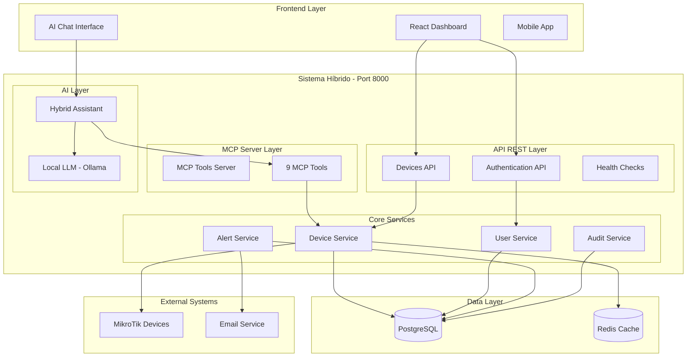

# System Architecture: MikroTik Controller Platform

## Overview

The MikroTik Controller Platform implements a **Sistema Híbrido** (Hybrid System) architecture that combines traditional REST API management with modern AI capabilities. The system provides both conventional network management interfaces and intelligent natural language interaction through an integrated AI assistant.

## High-Level Architecture



## Component Architecture

### 1. Frontend Layer

#### React Dashboard
- **Technology**: React 18+ with TypeScript
- **State Management**: Zustand + React Query
- **UI Framework**: Tailwind CSS with Headless UI
- **Real-time**: WebSocket connections for live updates
- **Features**:
  - Real-time device monitoring dashboard
  - Device management interface
  - Alert and notification system
  - Network topology visualization
  - Integrated AI chat interface

#### AI Chat Interface
- **Integration**: Embedded in main dashboard
- **Communication**: Direct connection to Hybrid Assistant
- **Features**:
  - Natural language device queries
  - Streaming responses
  - Command execution through chat
  - Contextual help and explanations

### 2. Sistema Híbrido Backend

#### API REST Layer
```python
# Main application structure
app/
├── main.py              # Traditional REST API
├── main_hybrid.py       # Hybrid system entry point
├── api/v1/
│   ├── auth.py         # JWT authentication
│   ├── devices.py      # Device management
│   └── health.py       # Health checks
├── core/
│   ├── database.py     # PostgreSQL connection
│   ├── security.py     # JWT and encryption
│   └── middleware.py   # Multi-tenant isolation
└── services/           # Business logic layer
```

**Key Features**:
- FastAPI framework with automatic OpenAPI documentation
- JWT-based authentication with refresh tokens
- Multi-tenant data isolation
- Comprehensive audit logging
- Rate limiting and security middleware

#### MCP Server Layer
```python
# MCP Integration
mcp_server.py           # Standalone MCP server
llm_integration.py      # LLM integration logic

# Available MCP Tools (9 tools)
1. list_devices         # List all devices
2. get_device          # Get device details
3. create_device       # Create new device
4. update_device       # Update device
5. delete_device       # Delete device
6. get_device_stats    # Device statistics
7. list_users          # List system users
8. get_audit_logs      # Audit log access
9. list_alerts         # System alerts
```

**Key Features**:
- Model Context Protocol (MCP) implementation
- Direct integration with core services
- Secure tool execution with user permissions
- Comprehensive error handling and logging

#### AI Layer
```python
# LLM Configuration
LLM Provider: Ollama
Model: llama3.2:3b (2GB)
Language: Spanish/English
Expertise: MikroTik RouterOS specific

# Hybrid Assistant Features
- Natural language query processing
- Automatic tool selection and execution
- Streaming response generation
- Context-aware conversations
- Multi-tenant isolation
```

**Key Features**:
- Local LLM processing (no external dependencies)
- MikroTik RouterOS expertise
- Automatic tool integration
- Streaming chat responses
- Privacy-focused design

### 3. Core Services Layer

#### Device Service
```python
class DeviceService:
    # CRUD operations
    async def create_device(data: DeviceCreateData) -> Device
    async def get_devices(filters: DeviceFilters) -> List[Device]
    async def update_device(id: str, data: DeviceUpdateData) -> Device
    async def delete_device(id: str) -> None
    
    # Statistics and monitoring
    async def get_device_stats() -> DeviceStats
    async def check_device_health(id: str) -> HealthStatus
    
    # Configuration management
    async def apply_template(device_id: str, template_id: str) -> Job
    async def backup_config(device_id: str) -> Backup
```

#### User Service
```python
class UserService:
    # Authentication
    async def authenticate(email: str, password: str) -> AuthResult
    async def refresh_token(refresh_token: str) -> TokenPair
    
    # User management
    async def create_user(data: UserCreateData) -> User
    async def update_user(id: str, data: UserUpdateData) -> User
    async def assign_role(user_id: str, role_id: str) -> None
```

#### Alert Service
```python
class AlertService:
    # Alert management
    async def create_alert(data: AlertCreateData) -> Alert
    async def acknowledge_alert(id: str, user_id: str) -> None
    async def resolve_alert(id: str, user_id: str) -> None
    
    # Notification delivery
    async def send_notification(alert: Alert) -> None
    async def get_alert_stats() -> AlertStats
```

### 4. Data Layer

#### PostgreSQL Database
```sql
-- Core tables
users                   -- User accounts and authentication
tenants                 -- Multi-tenant isolation
roles                   -- Role-based access control
permissions             -- Granular permissions
devices                 -- MikroTik device inventory
device_credentials      -- Encrypted device credentials
sites                   -- Logical device grouping
templates               -- Configuration templates
jobs                    -- Asynchronous task tracking
backups                 -- Configuration backups
alerts                  -- System alerts and notifications
audit_logs              -- Comprehensive audit trail
```

**Key Features**:
- Multi-tenant data isolation
- Encrypted credential storage
- Comprehensive audit logging
- Optimized indexes for performance
- Foreign key constraints for data integrity

#### Redis Cache
```python
# Caching strategy
Session Storage:        # JWT tokens and user sessions
Device Status Cache:    # Real-time device status
Configuration Cache:    # Template and configuration data
Rate Limiting:          # API rate limiting counters
WebSocket Sessions:     # Real-time connection management
```

## Security Architecture

### Authentication & Authorization
```python
# JWT Token Structure
{
    "sub": "user_id",
    "tenant_id": "tenant_uuid",
    "role": "admin|operator|viewer",
    "permissions": ["device:read", "device:write", ...],
    "exp": timestamp,
    "iat": timestamp
}

# Multi-tenant Isolation
- Database level: tenant_id in all queries
- API level: Automatic tenant filtering
- AI level: Tenant-isolated conversations
- Audit level: Per-tenant audit logs
```

### Data Protection
- **Encryption at Rest**: AES-256 for sensitive data
- **Encryption in Transit**: TLS 1.3 for all communications
- **Credential Security**: Encrypted device passwords
- **AI Privacy**: Local LLM processing, no external data sharing

### Access Control
```python
# Role-Based Access Control (RBAC)
Roles:
- Super Admin: Full system access
- Tenant Admin: Full tenant access
- Operator: Device management within tenant
- Viewer: Read-only access
- Technician: Limited device operations

# Permission System
Permissions are granular and resource-specific:
- device:read, device:write, device:delete
- user:read, user:write, user:delete
- template:read, template:write, template:delete
- audit:read, backup:read, alert:manage
```

## Scalability Architecture

### Horizontal Scaling
```yaml
# Deployment Architecture
Load Balancer:
  - NGINX or HAProxy
  - SSL termination
  - Request routing

Application Tier:
  - Multiple FastAPI instances
  - Stateless design
  - Shared Redis cache

Database Tier:
  - PostgreSQL primary/replica
  - Connection pooling
  - Read/write splitting

AI Tier:
  - Multiple Ollama instances
  - Load balancing for AI requests
  - Shared model storage
```

### Performance Optimization
- **Database**: Optimized queries, proper indexing, connection pooling
- **Caching**: Redis for frequently accessed data
- **API**: Async/await patterns, request batching
- **Frontend**: Code splitting, lazy loading, virtual scrolling
- **AI**: Model caching, response streaming, request queuing

## Integration Architecture

### MikroTik Device Integration
```python
# RouterOS API Integration
class MikroTikConnector:
    async def connect(host: str, credentials: DeviceCredentials)
    async def execute_command(command: str) -> CommandResult
    async def get_system_info() -> SystemInfo
    async def backup_configuration() -> ConfigBackup
    async def apply_configuration(config: str) -> ApplyResult
```

### External System Integration
- **Email/SMS**: Alert notifications
- **LDAP/AD**: User authentication integration
- **Monitoring**: Prometheus metrics export
- **Logging**: Structured logging with ELK stack support

## Deployment Architecture

### Development Environment
```bash
# Local development setup
backend/
├── setup_hybrid.sh     # Automated setup script
├── requirements-hybrid.txt
├── .env               # Environment configuration
└── docker-compose.yml # Optional containerization

frontend/
├── package.json       # Node.js dependencies
├── vite.config.ts     # Build configuration
└── .env.local         # Frontend environment
```

### Production Environment
```yaml
# Docker Compose Production
services:
  app:
    image: mikrotik-controller:latest
    environment:
      - DATABASE_URL=postgresql://...
      - REDIS_URL=redis://...
      - OLLAMA_URL=http://ollama:11434
    
  database:
    image: postgres:15
    volumes:
      - postgres_data:/var/lib/postgresql/data
    
  redis:
    image: redis:7-alpine
    
  ollama:
    image: ollama/ollama:latest
    volumes:
      - ollama_data:/root/.ollama
```

### Cloud Deployment Options
- **AWS**: ECS/EKS with RDS and ElastiCache
- **Google Cloud**: GKE with Cloud SQL and Memorystore
- **Azure**: AKS with Azure Database and Redis Cache
- **Self-hosted**: Docker Compose or Kubernetes

## Monitoring and Observability

### Application Monitoring
```python
# Metrics Collection
- Request/response times
- Error rates and types
- Database query performance
- AI response times
- WebSocket connection health
- Device connectivity status

# Logging Strategy
- Structured JSON logging
- Correlation IDs for request tracing
- Security event logging
- AI interaction logging
- Performance metrics logging
```

### Health Checks
```python
# Health Check Endpoints
GET /health              # Basic health check
GET /health/detailed     # Comprehensive system status
GET /health/database     # Database connectivity
GET /health/redis        # Cache connectivity
GET /health/ai           # AI service status
GET /health/devices      # Device connectivity summary
```

## Disaster Recovery

### Backup Strategy
- **Database**: Automated daily backups with point-in-time recovery
- **Configuration**: Version-controlled configuration templates
- **Device Configs**: Automated device configuration backups
- **AI Models**: Model versioning and backup storage

### High Availability
- **Database**: Primary/replica setup with automatic failover
- **Application**: Multiple instances behind load balancer
- **Cache**: Redis clustering for high availability
- **AI**: Multiple LLM instances for redundancy

## Future Architecture Considerations

### Planned Enhancements
- **Microservices**: Split monolith into focused services
- **Event Sourcing**: Implement event-driven architecture
- **GraphQL**: Add GraphQL API alongside REST
- **Machine Learning**: Advanced predictive analytics
- **Edge Computing**: Distributed processing capabilities

### Scalability Roadmap
- **Multi-region**: Global deployment with data replication
- **CDN Integration**: Static asset delivery optimization
- **Advanced Caching**: Multi-layer caching strategy
- **Database Sharding**: Horizontal database scaling
- **AI Optimization**: Custom model training and optimization